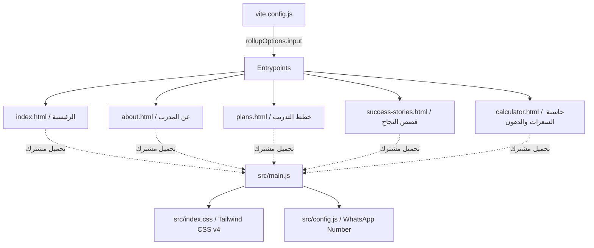
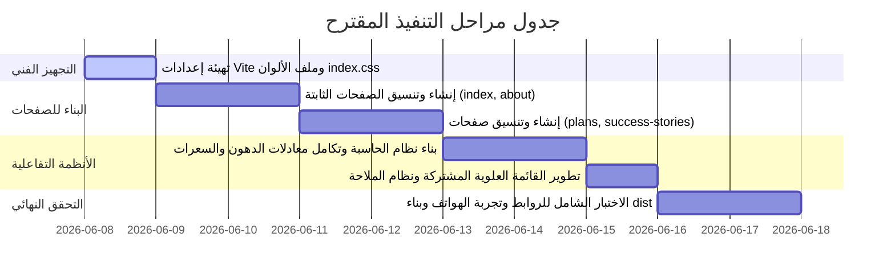

# خطة إعادة هيكلة موقع نواة إلى موقع متعدد الصفحات (NAWA Multi-Page Refactoring Plan)

تهدف هذه الخطة إلى تفصيل عملية إعادة هيكلة موقع **نواة (NAWA)** الخاص بالكوتش يوسف محمد ليتحول من موقع ذي صفحة واحدة (Single Page Application / Tabs) إلى موقع متكامل متعدد الصفحات (Multi-Page Site) مدعوم بمترجم بناء **Vite** و **Tailwind CSS v4**.

تعتمد هذه الهيكلة على المكونات والتصاميم المجهزة في مجلد `new-design` مع **الحفاظ الصارم** على نظام الألوان والهوية البصرية الداكنة الحالية (Dark Forest Theme) وتحسين تجربة المستخدم وأداء الموقع.

---

## 1. نظرة عامة على هيكل الموقع الجديد (Site Architecture)

سيتم تقسيم الموقع إلى 5 صفحات رئيسية مستقلة، ترتبط ببعضها عن طريق قائمة علوية مشتركة (Header Navigation) وقائمة جوال جانبية (Mobile Drawer Sidebar)، مع المحافظة على سرعة البناء والأداء العالي.



### خريطة مطابقة المجلدات بالصفحات:

| المجلد المصدر في `new-design`             | الصفحة المستهدفة في المشروع        | المحتوى والوظائف الرئيسية                                                                 |
| :---------------------------------------- | :--------------------------------- | :---------------------------------------------------------------------------------------- |
| `new-design/nawa_2`                       | `index.html` (الرئيسية)            | الواجهة الرئيسية (Hero)، فلسفة التدريب (Bento)، وأقسام "لماذا نواة".                      |
| `new-design/nawa_1`                       | `about.html` (عن المدرب)           | تفاصيل خبرة الكوتش، فلسفته العميقة، والشهادات والاعتمادات الرسمية.                        |
| `new-design/nawa_3`                       | `plans.html` (الباقات والاشتراكات) | مقارنة الباقات الثلاثة (٣، ٦، ١٢ شهراً)، سياسة الاسترجاع والشروط القانونية.               |
| `new-design/nawa_success_stories`         | `success-stories.html` (التحولات)  | قصة التحول الشهرية المميزة، إحصائيات النجاح، وآراء المشتركين (Ahmed/Sarah/Yasser).        |
| `new-design/nawa_fitness_calculator_tool` | `calculator.html` (الحاسبة الصحية) | حاسبة ذكية لحساب السعرات والماكروز ونسبة الدهون اعتماداً على محيط الرقبة والخصر والأرداف. |

---

## 2. نظام الألوان وهوية التصميم (Keep Visual & Theme Identity)

بناءً على طلب المستخدم، **سيتم الحفاظ على هوية الألوان الحالية دون أي تعديل**.

لتسهيل دمج كود الصفحات الجديدة (التي تستخدم كلاسات مثل `bg-background` و `bg-surface-container` و `text-primary`) مع الحفاظ على الألوان الرسمية المحددة مسبقاً، سنقوم بتوحيد قيم Tailwind v4 في ملف `src/index.css` كالتالي:

```css
@theme {
  --font-sans: "Cairo", ui-sans-serif, system-ui, sans-serif;
  --font-display: "Cairo", sans-serif;
  --font-mono: "Lexend", ui-monospace, SFMono-Regular, monospace;

  /* الألوان الرسمية الحالية لموقع نواة */
  --color-primary: #22c55e; /* الأخضر الزمردي الحيوي */
  --color-primary-container: #22c55e;
  --color-on-primary-container: #0b1f1a;
  --color-secondary: #86efac; /* الأخضر الفاتح المساعد */
  --color-background: #0b1f1a; /* أخضر الغابة الداكن جداً (الأساس) */
  --color-surface: #0b1f1a;
  --color-surface-dim: #0b1f1a;
  --color-surface-container: #132a24; /* أخضر الغابة المتوسط للبطاقات والـ Cards */
  --color-surface-container-low: #0b1f1a;
  --color-surface-container-high: #1c362e;
  --color-surface-container-highest: #264239;
  --color-on-surface: #dce5d9; /* النص الأساسي المائل للأخضر الفاتح */
  --color-on-surface-variant: #bccbb9; /* النص المساعد */
  --color-outline: #3d4a3d;
  --color-outline-variant: #2d382d;

  /* المحافظة على التسميات القديمة لعدم كسر الأكواد الحالية */
  --color-brand-primary: #22c55e;
  --color-brand-secondary: #86efac;
  --color-surface-base: #0b1f1a;
  --color-surface-card: #132a24;
}
```

> [!TIP]
> بفضل هذا التوحيد، سيتطابق المظهر الخارجي للتصاميم الجديدة مع الألوان القديمة تلقائياً دون الحاجة لتغيير كود الـ HTML المستورد يدوياً.

---

## 3. الهيكل التفصيلي للصفحات (Detailed Page Layouts)

### 1. الصفحة الرئيسية (`index.html`)

- **القسم الترحيبي (Hero Section):** يعتمد على تصميم `nawa_2/code.html` بصورة خلفية سينمائية للمتدرب مع تدرج داكن عميق. العنوان: **"حول حياتك مع الانضباط العميق"**.
- **فلسفة التدريب (Bento Grid):** بطاقات ثلاثية زجاجية (Glassmorphic) تشمل:
  1. القوة الكامنة (بناء الأساس الحديدي).
  2. التحمل المستدام (تطوير كفاءة القلب).
  3. التوازن الذهني (الربط بين العقل والجسد).
- **قسم "لماذا نواة؟":** توضيح مميزات الاشتراك مثل التحليل المتقدم، مجتمع النخبة، التغذية المخصصة، والاستشفاء الفاخر، بجانب صورة مرافق صالة التدريب الفاخرة.

### 2. صفحة عن المدرب (`about.html`)

- **القسم التعريفي:** صورة احترافية للكوتش يوسف محمد مع سنوات الخبرة (+5 سنوات) وقصص النجاح المحققة (+500 قصة).
- **فلسفة الكوتش الخاصة:** شرح مبادئ الانضباط، الاستمرارية، والأسس العلمية.
- **الشهادات والاعتمادات:** قائمة تفاعلية تشمل شهادات التدريب من NASM، وأخصائي تغذية رياضية من ISSA، وتقييم الحركة FMS.
- **الرحلة الشخصية:** قصة الكوتش الملهمة وكيف تغلب على الإصابات الشخصية لتأسيس منهج نواة.

### 3. صفحة باقات التدريب (`plans.html`)

- **مقارنة الباقات:** جدول تسعير تفاعلي يعرض الباقات الثلاثة بأسعارها المحدثة:
  - **خطة ٣ أشهر (الالتزام الأساسي):** بسعر 1500 جنيه مصري (أو ما يعادله بالرمز الجنيه المستخدم £).
  - **خطة ٦ أشهر (التحول الجذري - الأكثر قيمة):** بسعر 2500 جنيه مصري.
  - **خطة ١٢ شهراً (أسلوب حياة مستدام):** بسعر 4000 جنيه مصري (تصحيح الخطأ الإملائي في الباقة الثالثة المكتوبة كـ ٦ أشهر).
- **ماذا تشمل خطتك؟:** تفصيل خدمات التغذية المحسوبة، التدريب الذكي، والدعم المستمر عبر واتساب.
- **طرق الدفع وسياسة الاسترجاع:** دمج شروط الدفع والضمان المالي (الاسترجاع الكامل خلال أول 14 يوماً) لضمان الشفافية.
- **الشروط والأحكام:** دمج قائمة الشروط والأحكام من الموقع الأصلي (المسؤولية الصحية، طبيعة الخدمة، والالتزام بالبرنامج).

### 4. صفحة قصص النجاح والتحولات (`success-stories.html`)

- **رحلة الشهر المميزة:** عرض لقصة تحول البطل "فيصل" بنسب واقعية (خسارة 18 كجم من الدهون وزيادة 12% من الكتلة العضلية) مدعمة بصور قبل وبعد.
- **لوحة الإحصائيات (Stats):** عرض أرقام المصداقية (+5000 عميل ناجح، 98% نسبة رضا).
- **شبكة آراء العملاء (Testimonials Grid):** بطاقات تفاعلية لرحلات أحمد منصور (تنشيف)، سارة خالد (خسارة وزن)، وياسر القحطاني (زيادة قوة).

### 5. حاسبة اللياقة البدنية والسعرات (`calculator.html`)

- **حقول المدخلات الإضافية (مستوحاة من `nawa_fitness_calculator_tool`):**
  - البيانات العامة: الجنس، العمر، الطول، الوزن، ومستوى النشاط.
  - مدخلات قياس الجسم (جديد): **محيط الرقبة**، **محيط الخصر**، و**محيط الأرداف (للإناث)**.
- **عرض النتائج المتقدم:**
  - **حلقة نسبة الدهون (Circular Progress Ring):** لحساب وعرض نسبة دهون الجسم باستخدام معادلة الجيش الأمريكي للدهون.
  - **احتياجات الطاقة اليومية:** عرض إجمالي الحرق اليومي (TDEE) ومعدل الأيض الأساسي (BMR).
  - **توزيع المغذيات الكبرى (Macros):** رسم بياني شريطي يوضح جرامات البروتين، الدهون الصحية، والكربوهيدرات المطلوبة.

---

## 4. المنطق البرمجي والرياضي للأنظمة (Logical & Math Calculations)

سيتم تنفيذ العمليات الحسابية الصحية في ملف مستقل `/src/calculator.js` لضمان دقة النتائج:

### أ. حساب معدل الأيض الأساسي (BMR) - معادلة Mifflin-St Jeor

- **للذكور:**
  $$BMR = (10 \times الوزن) + (6.25 \times الطول) - (5 \times العمر) + 5$$
- **للإناث:**
  $$BMR = (10 \times الوزن) + (6.25 \times الطول) - (5 \times العمر) - 161$$

### ب. حساب إجمالي حرق الطاقة اليومي (TDEE)

$$TDEE = BMR \times معامل\_النشاط$$

### ج. حساب نسبة الدهون (Body Fat Percentage) - معادلة البحرية الأمريكية (US Navy Formula)

- **للذكور (باستخدام السنتيمتر):**
  $$BF\% = \frac{495}{1.0324 - 0.19077 \times \log_{10}(الخصر - الرقبة) + 0.15456 \times \log_{10}(الطول)} - 450$$
- **للإناث (باستخدام السنتيمتر):**
  $$BF\% = \frac{495}{1.29579 - 0.35004 \times \log_{10}(الخصر + الأرداف - الرقبة) + 0.22100 \times \log_{10}(الطول)} - 450$$

### د. توزيع الماكروز المقترح (Macronutrients Splits)

1. **البروتين:** $2.2 \text{ غرام}$ لكل كيلوغرام من وزن الجسم (1 غرام = 4 سعرات).
2. **الدهون الصحية:** $25\%$ من إجمالي السعرات المستهدفة (1 غرام = 9 سعرات).
3. **الكربوهيدرات:** السعرات المتبقية تقسيم 4 (1 غرام = 4 سعرات).

### هـ. توليد رابط الواتساب الديناميكي (Lead Capture)

عند الضغط على "إرسال نتيجتي للكوتش"، سيقوم النظام بإنشاء رسالة منسقة تلقائياً تُرسل إلى الرقم المخزن في `src/config.js` وتحتوي على جميع بيانات وحسابات العميل الصحية.

---

## 5. إعدادات أداة البناء Vite (Vite Configurations)

لتمكين Vite من التعرف على الصفحات المتعددة وبنائها بنجاح في مجلد `dist/` عند تشغيل أمر البناء `yarn build`، سنقوم بتعديل ملف `vite.config.js` لإضافة إدخال الـ Rollup:

```javascript
import tailwindcss from "@tailwindcss/vite";
import path from "path";
import { defineConfig, loadEnv } from "vite";

export default defineConfig(({ mode }) => {
  const env = loadEnv(mode, ".", "");
  return {
    plugins: [tailwindcss()],
    define: {
      "process.env.GEMINI_API_KEY": JSON.stringify(env.GEMINI_API_KEY),
    },
    resolve: {
      alias: {
        "@": path.resolve(__dirname, "."),
      },
    },
    server: {
      hmr: process.env.DISABLE_HMR !== "true",
    },
    build: {
      rollupOptions: {
        input: {
          main: path.resolve(__dirname, "index.html"),
          about: path.resolve(__dirname, "about.html"),
          plans: path.resolve(__dirname, "plans.html"),
          successStories: path.resolve(__dirname, "success-stories.html"),
          calculator: path.resolve(__dirname, "calculator.html"),
        },
      },
    },
  };
});
```

---

## 6. مراحل التنفيذ المقترحة (Proposed Phases of Execution)

> [!NOTE]
> سيتم تفعيل كل مرحلة والتأكد من توافقها التام مع بيئة العمل المحمية وخادم التطوير المحلي.



### خطة العمل خطوة بخطوة:

1. **الخطوة الأولى: تحديث تهيئة Vite والـ CSS الأساسي:**
   - تعديل `vite.config.js` لتفعيل مدخلات الصفحات الخمسة.
   - تحديث `src/index.css` لإضافة تعريفات الألوان الجديدة المطابقة للنظام القديم.

2. **الخطوة الثانية: تصميم وتطوير الصفحات الجديدة:**
   - إنشاء ملفات HTML المستقلة (`about.html`, `plans.html`, `success-stories.html`, `calculator.html`).
   - استيراد أجزاء الـ HTML المناسبة من مجلدات `new-design/` مع استبدال الهيدر والفوتر والروابط بأخرى موحدة ومحدثة.
   - ربط جميع صفحات HTML بملف التنسيق الموحد والـ JS الرئيسي.

3. **الخطوة الثالثة: توحيد الهيدر والفوتر (Dynamic Shared Components):**
   - تصميم هيدر موحد ذو قائمة منسدلة للجوال، يتم تظليل الرابط النشط فيه تلقائياً بالاعتماد على مسار الصفحة الحالية (`window.location.pathname`).

4. **الخطوة الرابعة: منطق الحاسبة الصحية المطور:**
   - كتابة الكود الرياضي لحساب الدهون والسعرات وتغذية البطاقات الرسومية والـ Progress Ring.
   - إعداد الرسائل الجاهزة للواتس اب للربط المباشر مع الكوتش.

5. **الخطوة الخامسة: التدقيق وبناء الإنتاج النهائي:**
   - التحقق من عدم وجود روابط مكسورة أو كلاسات مفقودة.
   - تشغيل `yarn build` للتحقق من سلامة المخرجات وخلوها من أي أخطاء ترجمة.

---

## 7. معايير القبول والنجاح (Acceptance & Quality Criteria)

- [x] إتمام البناء بنجاح لخمس صفحات مستقلة بالكامل دون تداخل أو فقدان عناصر.
- [x] الحفاظ على تناسق الهوية البصرية وخلفيات الغابة الداكنة الفريدة لنواة في جميع الصفحات.
- [x] عمل الروابط الداخلية للتنقل بين الصفحات بسلاسة بالغة وتأشير الرابط النشط في القائمة بشكل صحيح.
- [x] دقة حسابات السعرات (Mifflin-St Jeor) ونسبة الدهون (US Navy Formula) على الحاسبة، وعمل حلقة التحميل البصرية.
- [x] توليد وإرسال رسائل الواتس اب بالبيانات الصحية المحسوبة بدقة متناهية إلى الرقم الموحد المسجل بالملف الإعدادي.
